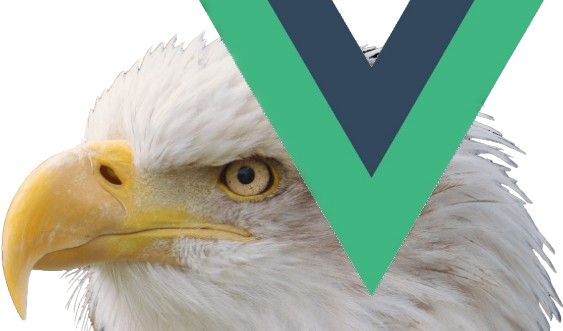

	

	
	
	
	
	
	
	
	

# Vue Eagle Eye

<table BORDER-COLOR="0a0" BORDER-WIDTH="2">
    <td VALIGN="middle" ALIGN="center" FONT-WEIGHT="BOLD" COLOR="#333" HEIGHT="250px" width="1250px">
		COMPATIBLE WITH VUE VERSION 2.3.0 AND BEYOND. 
	</td>
</table>
<ul>
	<li> Ready for use anywhere in the app.</li>
	<li> Auto-immutable update-friendly context. See <a href="https://vue-eagleeye.js.org/concepts//setstate"><code>.setState</code></a>.</li>
	<li> A context bearing an observable consumer <a href="https://vue-eagleeye.js.org/concepts/store">store</a>.</li>
	<li> Recognizes <b>negative array indexing</b>. Please see <a href="https://vue-eagleeye.js.org/concepts/property-path">Property Path</a> and <code>store.setState</code> <a href="https://vue-eagleeye.js.org/concepts/store/setstate#indexing">Indexing</a>.</li>
	<li> Only re-renders subscribing components (<a href="https://vue-eagleeye.js.org/concepts/client">clients</a>) on context state changes.</li>
	<li> Subscribing component decides which context state properties' changes to trigger its update.</li>
	<li>OOB Support for framework-agnostic state sharing among applications. Simply create an <a href="https://auto-immutable.js.org/intro/">Auto Immutable</a> instance to pass around as the <code>value</code> argument for this or any <a href="https://eagleeye.js.org">Eagle Eye</a> based state manager instances.</li>
</ul>

**Name:** Vue Eagle Eye.

**Usage:** Please see <b><a href="https://vue-eagleeye.js.org/getting-started">Getting Started</a></b>.

**Demo:** [Play with the app on codesandbox](https://codesandbox.io/s/github/webKrafters/vue-eagleeye-app)\
If sandbox fails to load app, please refresh dependencies on its lower left.

If the problem persits, 

<ol>
	<li>clone the demo app <a href="https://github.com/webKrafters/ng-eagleeye-app" rel="no-follow">repository</a>.</li>
	<li>CD to the cloned demo app project's root folder.</li>
	<li>run `npm i`</li>
	<li>run `npm i -S <pkg_name>` for all the packages in this `peerDependencies`of this library's package.json object.</li>
	<li>and then `npm run vite`</li>
</ol>

**Install:**\
npm install --save @webkrafters/vue-eagleeye

May also see <b><a href="https://vue-eagleeye.js.org/history/features">What's Changed?</a></b>

Full Documentation: **[vue-eagleeye.js.org](https://vue-eagleeye.js.org)**

# License

GPLv3
